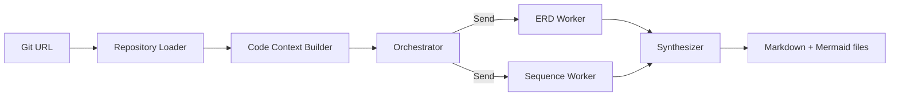
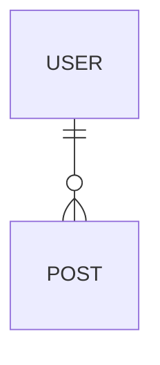

# Git Diagram Orchestrator

Git 저장소 URL을 입력하면 LangGraph의 orchestrator-worker 패턴으로 두 작업자를 병렬 실행합니다.

- **ERD Worker**: 엔티티, 테이블, ORM 모델, PK/FK 및 관계를 분석하여 Mermaid `erDiagram` 생성
- **Request Mapping Discovery Worker**: 전체 소스에서 모든 HTTP Request Mapping을 수집
- **Sequence Worker**: 발견된 각 Request Mapping별로 컨트롤러/API → 서비스 → 저장소/외부 시스템 흐름을 분석하여 Mermaid `sequenceDiagram` 생성
- **Synthesizer**: 결과 검증 후 Markdown 및 `.mmd` 파일 저장

## Architecture



## OpenAI API 키 설정

```bash
cp .env.example .env
```

## 설치

```bash
uv venv
```

## 활성화

```bash
source .venv/bin/activate   # Windows: .venv\Scripts\activate
```

## 패키지 설치

```bash
uv pip install -e .
```

## worker 개별 실행
```bash
diagrams <git-url> --diagram erd
diagrams <git-url> --diagram sequence
```

## 실행 예제 1)

```bash
# 게시판 예제
diagrams https://github.com/hojunnnnn/board.git
```

## 실행 예제 2)
```bash
# 블로그 예제
diagrams https://github.com/94-c/study_spring-boot-react-blog.git
```

## worker 개별 실행 예제 erd)
```bash
diagrams https://github.com/94-c/study_spring-boot-react-blog.git --diagram erd
```

## worker 개별 실행 예제 sequence diagram)
```bash
diagrams https://github.com/94-c/study_spring-boot-react-blog.git --diagram sequence
```

출력 위치:

```text
outputs/
├── <repo>-diagrams.md
├── <repo>-erd.mmd
├── <repo>-diagrams.md
└── <repo>-sequences/
    ├── README.md
    ├── 001-get-...mmd
    ├── 002-post-...mmd
    └── ...
```

## Private repository

환경변수 `GIT_TOKEN`을 설정하세요. 토큰은 명령행과 로그에 노출하지 않습니다.

## 주요 설계

1. `git clone --depth 1`로 저장소 수집
2. 소스 파일을 경로/확장자/크기로 필터링
3. LLM이 분석할 수 있는 compact repository context 생성
4. 오케스트레이터가 작업 계획을 생성
5. LangGraph `Send` API로 worker를 동적 병렬 실행
6. Mermaid 문법 fence 제거 및 시작 키워드 검증
7. 결과 파일 저장

## 주의

- 생성 결과는 코드에서 추론한 문서이므로 반드시 개발자가 검토해야 합니다.
- 저장소가 매우 크면 `--max-files`, `--max-chars-per-file`, `--max-total-chars` 값을 조정하세요.
- 기본적으로 lock 파일, build 산출물, 바이너리, vendor 디렉터리는 제외됩니다.

## Mermaid sequence 문법 검증

Sequence worker 결과는 저장 전에 다음 과정을 거칩니다.

1. Markdown fence 및 비표준 화살표 문자를 정리합니다.
2. `->>+`, `-->>-` 같은 화살표 activation marker를 제거하고 명시적 `activate`/`deactivate` 방식으로 통일합니다.
3. participant 선언, message 형식, activation 균형, `alt/opt/loop/par` 블록의 `end`를 검사합니다.
4. 오류가 있으면 오류 목록과 기존 다이어그램을 repair worker에 전달하여 최대 2회 재생성합니다.
5. 끝까지 남은 문제는 출력 Markdown의 Warnings에 기록합니다.


## ERD 관계 라벨 정책

ERD 관계선의 `has`, `writes`, `owns`, `belongs to` 같은 설명 문구는 표시하지 않습니다. Mermaid ER 문법상 관계 라벨 위치가 필요하므로 내부 코드는 다음처럼 빈 문자열로 정규화됩니다.



## 전체 Request Mapping Sequence 생성

Sequence 생성 시 대표 API 하나만 선택하지 않습니다. 저장소 컨텍스트에서 다음 항목을 모두 수집한 뒤 엔드포인트별 독립 다이어그램을 만듭니다.

- Spring `@RequestMapping`, `@GetMapping`, `@PostMapping`, `@PutMapping`, `@PatchMapping`, `@DeleteMapping`
- 클래스 수준 경로와 메서드 수준 경로의 결합
- 하나의 annotation에 선언된 복수 경로 또는 복수 HTTP method
- 컨텍스트에 나타난 다른 웹 프레임워크의 동등한 route 정의

통합 Markdown인 `<repo>-diagrams.md`에는 모든 엔드포인트 다이어그램이 순서대로 포함되며, `<repo>-sequences/`에는 엔드포인트별 `.mmd` 파일이 저장됩니다.

