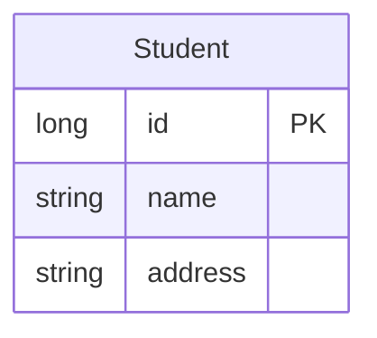
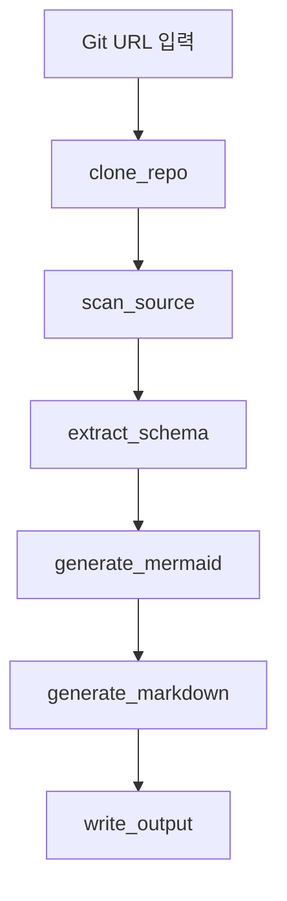

# ERD Agent

LangGraph를 이용해서 특정 Git URL의 소스를 분석하고, Mermaid.js ERD 코드가 포함된 Markdown 파일을 생성하는 AI Agent입니다.

## 기능

- Git 저장소 clone
- Java/Spring Boot JPA Entity 분석
- `@Entity`, `@Table`, `@Id`, `@Column`, `@ManyToOne`, `@OneToMany`, `@OneToOne`, `@JoinColumn` 기반 ERD 추출
- SQL DDL `CREATE TABLE` 기본 분석
- Mermaid.js `erDiagram` 생성
- Markdown 파일 자동 생성


## OpenAI API 키 설정

```bash
cp .env.example .env
```

## 설치

```bash
uv venv .venv
```

## 활성화

```bash
source .venv/bin/activate   # Windows: .venv\Scripts\activate
```

## 패키지 설치

```bash
uv pip install -e .
```

## 실행 예제 1)

```bash
# 게시판 예제
erd-agent https://github.com/hojunnnnn/board.git --output erd.md
```

## 실행 예제 2)
```bash
# 블로그 예제
erd-agent https://github.com/94-c/study_spring-boot-react-blog.git --output erd.md
```

## 출력 예시

````markdown
# ERD Diagram

Repository: https://github.com/example/project.git

## Mermaid ERD


````

## 구조

```text
erd_agent/
  agent.py      # LangGraph workflow
  parser.py     # 소스 분석 및 Mermaid 생성
  cli.py        # Typer CLI
  models.py     # State / Entity models
```

## LangGraph Workflow

