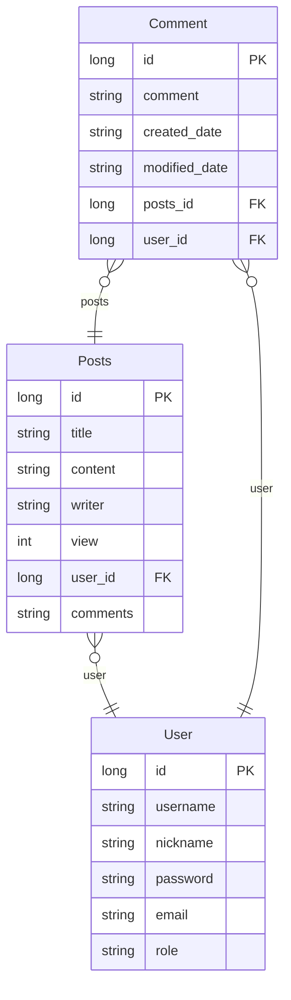

# Repository

https://github.com/hojunnnnn/board.git

## Entity Summary

- `Posts`: 7 fields
- `User`: 6 fields
- `Comment`: 6 fields

## Mermaid ERD

```mermaid
erDiagram
    Posts {
        long id PK
        string title
        string content
        string writer
        int view
        long user_id FK
        string comments
    }
    User {
        long id PK
        string username
        string nickname
        string password
        string email
        string role
    }
    Comment {
        long id PK
        string comment
        string created_date
        string modified_date
        long posts_id FK
        long user_id FK
    }
    Posts }o--|| User : user
    Comment }o--|| Posts : posts
    Comment }o--|| User : user
```
