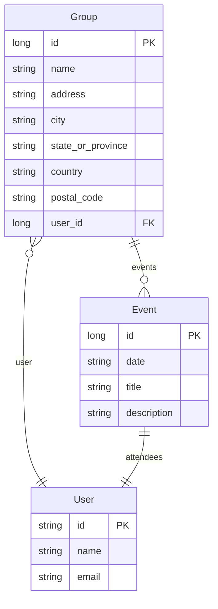

# Repository

https://github.com/94-c/study_spring-boot-react-blog.git

## Entity Summary

- `Group`: 8 fields
- `User`: 3 fields
- `Event`: 4 fields

## Mermaid ERD

```mermaid
erDiagram
    Group {
        long id PK
        string name
        string address
        string city
        string state_or_province
        string country
        string postal_code
        long user_id FK
    }
    User {
        string id PK
        string name
        string email
    }
    Event {
        long id PK
        string date
        string title
        string description
    }
    Group }o--|| User : user
    Group ||--o{ Event : events
    Event ||--|| User : attendees
```
