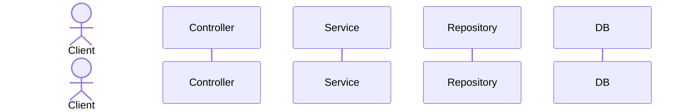
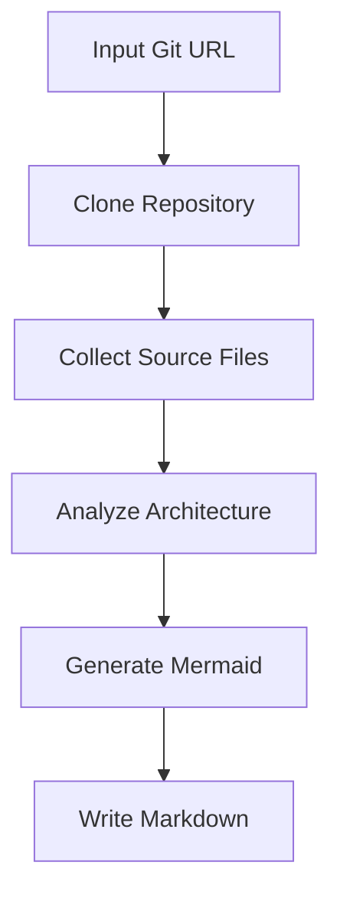

# Sequence Diagram Agent

LangGraph를 이용해 특정 Git 저장소 URL을 분석하고, Mermaid.js sequence diagram 코드가 포함된 Markdown 파일을 생성하는 에이전트입니다.

## 기능

- Git 저장소 clone
- 주요 소스 파일 자동 수집
- Controller / Service / Repository / Entity 흐름 추정
- LangGraph 노드 기반 파이프라인 실행
- Mermaid sequence diagram 생성
- Markdown 문서 생성
- LLM 사용 가능, API 키가 없으면 휴리스틱 모드로 동작


## OpenAI API 키 설정

```bash
cp .env.example .env
```

## 설치

```bash
uv venv .venv
```

## 활성화

```bash
source .venv/bin/activate   # Windows: .venv\Scripts\activate
```

## 패키지 설치

```bash
uv pip install -e .
```

## 실행 예제 1)

```bash
# 게시판 예제
sequence-agent https://github.com/hojunnnnn/board.git --output output.md
```

## 실행 예제 2)
```bash
# 블로그 예제
sequence-agent https://github.com/94-c/study_spring-boot-react-blog.git --output output.md
```

## 출력 예시

생성되는 Markdown에는 아래 형식이 포함됩니다.

````markdown
# Sequence Diagram


````

## LangGraph 흐름


