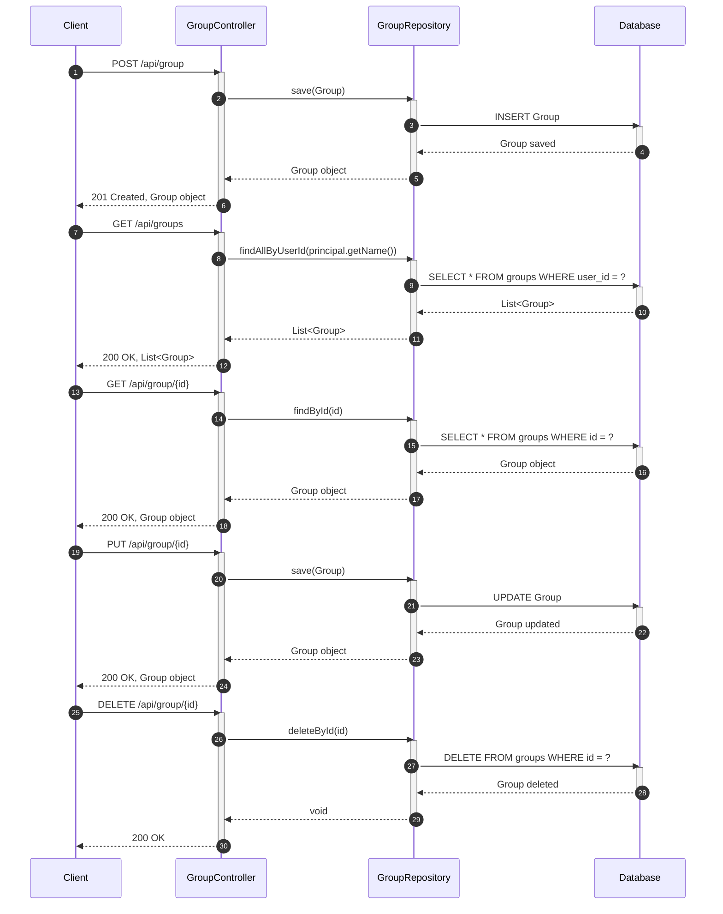

# Git Repository Sequence Diagram

## Repository

https://github.com/94-c/study_spring-boot-react-blog.git

## Architecture Summary

```text
Detected architecture summary:
- Controllers: GroupController, UserController
- Services: Not detected
- Repositories: GroupRepository, UserRepository
- Entities/Models: Event, Group, User
- Config files: .mvn/wrapper/maven-wrapper.properties, pom.xml, src/main/resources/application.yaml
```

## Sequence Diagram


