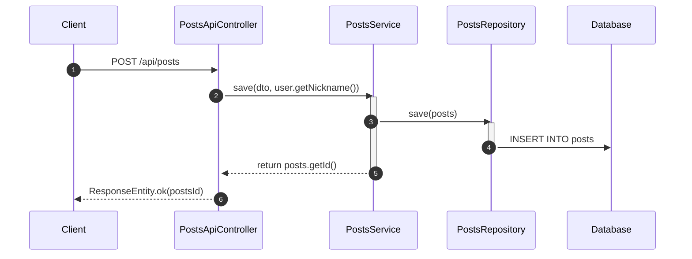

# Git Repository Sequence Diagram

## Repository

https://github.com/hojunnnnn/board.git

## Architecture Summary

```text
Detected architecture summary:
- Controllers: CommentApiController, PostsApiController, PostsApiControllerTest, PostsIndexController, UserApiController, UserController
- Services: CommentService, CustomOAuth2UserService, CustomUserDetailsService, PostsService, PostsServiceTest, UserService
- Repositories: CommentRepository, CommentRepositoryTest, PostsRepository, PostsRepositoryTest, UserRepository, UserRepositoryTest
- Entities/Models: BaseTimeEntity, Comment, Posts, User
- Config files: build.gradle, gradle/wrapper/gradle-wrapper.properties, settings.gradle, src/main/resources/application.properties
```

## Sequence Diagram


